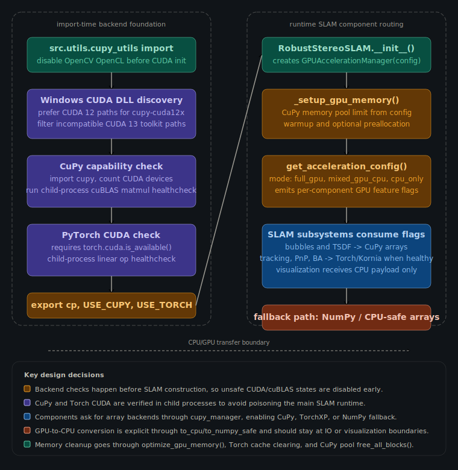

# GPU Acceleration Architecture

This diagram documents how GPU acceleration is selected and kept safe in the SLAM runtime.

The key rule is that backend health is established before component routing. `src/utils/cupy_utils.py` owns CUDA path guards, CuPy and Torch CUDA health checks, lazy backend selection, and CPU/GPU transfer helpers. `src/utils/gpu_acceleration.py` then turns those backend facts plus `acceleration_mode` into per-component flags consumed by the SLAM system.

GPU arrays should stay inside compute-heavy mapping, tracking, stereo, PnP, BA, and PGO paths. Explicit CPU conversion should happen at IO, debugging, shutdown, and visualization boundaries.
